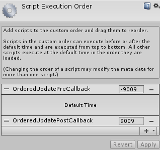

# Unity3D Ordered Update
This script helps you receive **Update** callbacks from any of your scripts or objects, in any order. Here are some common use-cases:

- Receiving Update callback in *static* or *non-MonoBehaviour* objects
- Calling a **PreUpdate** function "**before**" all the Update calls (similar to how LateUpdate is called "*after*" all the Update calls)
- Calling a function before/after all the *Update*, *LateUpdate* and/or *FixedUpdate* calls
- Making sure that object A's Update method is called before object B's Update method
- Receiving Update calls even if the object is inactive

Simply import **OrderedUpdate.unitypackage** into your project and you are good to go! Just make sure that the execution orders of **OrderedUpdatePreCallback** and **OrderedUpdatePostCallback** are correct in **Edit-Project Settings-Script Execution Order**:



## How To
- To receive an Update callback in any of your objects, it is sufficient to register to `OrderedUpdate.OnUpdate` event. But don't forget to unregister from the event when the object is destroyed, just in case (so, using anonymous functions is not recommended unless you know what you are doing).
- To receive a callback before all the Update calls, you can register to `OrderedUpdate.OnPreUpdate` event. For example:

```csharp
void Awake() {
	OrderedUpdate.OnPreUpdate += OnPreUpdate;
}

private void OnPreUpdate() {
	// called every frame, before other Update calls
}

void OnDestroy() {
	OrderedUpdate.OnPreUpdate -= OnPreUpdate;
}
```

- To receive a callback before/after all the Update, LateUpdate and/or FixedUpdate calls, use one of the following functions with a custom order:

```csharp
OrderedUpdate.AddUpdateReceiver( OrderedUpdate.UpdateCallback receiver, int order );
OrderedUpdate.AddFixedUpdateReceiver( OrderedUpdate.UpdateCallback receiver, int order );
OrderedUpdate.AddLateUpdateReceiver( OrderedUpdate.UpdateCallback receiver, int order );
```

- To call an A function (located in any of your scripts) before a B function (again, located in any of your scripts) every frame, just make sure that function A's order is smaller than function B's order while calling *AddUpdateReceiver/AddFixedUpdateReceiver/AddLateUpdateReceiver*.

- An Update callback registered to OrderedUpdate continues to execute even if the container object becomes inactive later in the game. If you don't want to call the function if the object is inactive, simply register your function to OrderedUpdate in **OnEnable** and unregister it in **OnDisable**.

## Method Signatures
```csharp
public delegate void UpdateCallback();

public static event UpdateCallback OnPreUpdate;
public static event UpdateCallback OnUpdate;
public static event UpdateCallback OnFixedUpdate;
public static event UpdateCallback OnLateUpdate;

public static void OrderedUpdate.AddUpdateReceiver( UpdateCallback receiver, int order = 0 );
public static void OrderedUpdate.AddFixedUpdateReceiver( UpdateCallback receiver, int order = 0 );
public static void OrderedUpdate.AddLateUpdateReceiver( UpdateCallback receiver, int order = 0 );

public static void OrderedUpdate.RemoveUpdateReceiver( UpdateCallback receiver, int order = 0 );
public static void OrderedUpdate.RemoveFixedUpdateReceiver( UpdateCallback receiver, int order = 0 );
public static void OrderedUpdate.RemoveLateUpdateReceiver( UpdateCallback receiver, int order = 0 );
```
